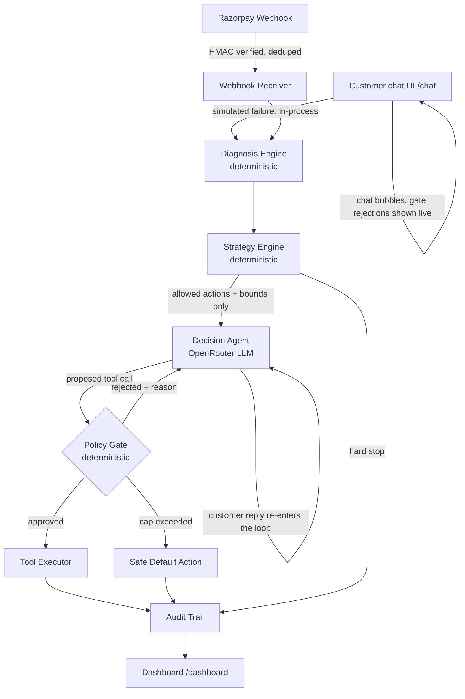

# Project Lazarus

**AI-powered revenue recovery agent** — Razorpay Buildathon, Track 03.

Detects revenue at risk (payment drop-offs, checkout abandonment, failed subscriptions),
diagnoses the cause deterministically, negotiates the recovery *within merchant-defined
bounds* using an LLM, and resumes the customer's exact checkout state via a deep link —
with every decision logged and every LLM action re-validated against a strategy config
it cannot override.

> The LLM is a **negotiator inside a fence**, not a decision-maker. The fence — discount
> caps, retry limits, cooldowns — is deterministic code the merchant configures. Every
> proposed tool call is checked against it before anything executes.

## Status

The full 50-case batch has completed end-to-end: **38 actioned (76%), 2 correctly
hard-stopped, 10 no-action, 0 errors**, live against the real agent — see
[`data/metrics_report.md`](data/metrics_report.md) for the full breakdown and honest
exception list. See [`docs/plan.md`](docs/plan.md) for the architecture and timeline, and
[`docs/pitch_script.md`](docs/pitch_script.md) for the 5-minute pitch outline.

Two live web UIs sit on top of the same pipeline: **`/chat`**, where a judge can simulate a
payment failure and talk to Lazarus directly, turn by turn, with every proposed action gated
live; and **`/dashboard`**, which audits everything — the completed batch run, every live
chat case, a real-time activity feed, and an editable view of the strategy config itself. See
[Live demo](#live-demo) below.

## Architecture



The LLM decides **which** allowed action to take and **how** to phrase it. It never decides
**how much** (discount %) or **how many times** (retries) — those come from the strategy
config, and every proposed tool call is re-checked against them in code before anything
executes. `/chat` re-enters that same loop on every customer reply rather than running it
once; a customer's message can change what the agent *says*, never what it's *allowed to do*.

## What is live vs. simulated

This table is the honest accounting. It is updated as components land — nothing here is
aspirational.

| Component | Status |
|---|---|
| Razorpay webhook receipt + signature verification + idempotency | Done — SQLite-backed dedupe, survives restart |
| Razorpay test-mode orders | Done — `scripts/create_razorpay_orders.py`, real orders via the live test API |
| State serialization / checkout hydration | Not started |
| Error diagnosis engine | Done — deterministic, unmapped codes fall to `unknown`, no code at all means `abandoned_checkout` |
| Strategy config engine | Done — hard_stops → rules → defaults, includes a B2B receivables rule |
| Decision agent (OpenRouter) | Done — capped reject-and-correct loop. Runs on a small paid model (`z-ai/glm-5.3-flash`) on a key with an explicit $4 hard spend cap — real cost verified at ~$0.000006/call before switching, so a full 50-case batch costs a fraction of a cent, and it's noticeably faster per call than the free model this project started on. That's now the code default too (`app/config.py`); pass a free `:free` model via `OPENROUTER_MODEL` instead if you'd rather not add a paid key. Earlier runs on the free model surfaced (and fixed) two real reliability issues worth knowing about regardless of which model you run: OpenRouter's free tier shares one account-wide cap (50 requests/day across *all* free models combined, not per-model — `scripts/run_batch.py` resumes automatically to work around it), and a smaller model sometimes reasons about the right tool call in plain text instead of emitting one — the agent now nudges once before accepting that as "no action needed." |
| Policy gate | Done — action/discount/retry/cooldown + message-body scan |
| Webhook → agent pipeline wiring | Done — `payment.failed` only; checkout abandonment needs separate tracking (not built) |
| Customer history store (LTV, abandon count, cooldown) | Done, SQLite — LTV/opt-in are placeholders pending real CRM backfill |
| 50-record batch (`data/batch_cases.json`) | 20 subscription-failure / 15 checkout-abandonment / 15 receivable. **checkout-abandonment** is now fully real (`is_synthetic: false`) — real test-mode orders, genuinely left unpaid, exactly as plan §8 specifies. **subscription-failure** stays `is_synthetic: true` — the order is real but the failure event is still modeled (Razorpay's test mode has no server-only way to force a card decline outside the checkout.js/browser flow; plan §8 itself specifies "orders + modeled failure events"). **receivable** stays fully synthetic by design. |
| Batch runner (`scripts/run_batch.py`) | Done — full live run completed, 50/50 cases resolved. `--dry-run` resolves diagnosis+strategy only (no API key, no cost) |
| Metrics report (`scripts/generate_report.py` → `data/metrics_report.md`) | Done — recovery-attempt rate, outcome breakdown by category, guardrail evidence, honest exception list |
| WhatsApp delivery | Not started — deliberately superseded by the `/chat` web UI (see below) so judges don't need to set up WhatsApp/Telegram to see the agent talk to a customer; `console` stays the default `NOTIFY_CHANNEL` |
| Customer chat UI (`/chat`) | Done — multi-turn, same agent loop and policy gate as the webhook pipeline; failure trigger is simulated in-process (no real Razorpay webhook delivery needed for a demo), clearly logged as `is_synthetic: true` |
| Merchant dashboard (`/dashboard`) | Done — batch-run metrics, live case list, per-case audit trail + transcript, real-time activity feed, and a live-editable strategy config (edits apply to the next case immediately, no redeploy) |
| Hosting (Vercel) | Done — see [Deploying to Vercel](#deploying-to-vercel). Storage auto-switches to Turso (libSQL) when `DATABASE_URL` is set, since Vercel's filesystem is ephemeral; local dev is unaffected and stays on SQLite/JSONL |
| Voice channel (`/voice`) | **Phases 1 and 2 done, phase 3 not started** — see [`docs/voice.md`](docs/voice.md). Phase 1: the deterministic architecture (pre-dial gate, per-turn dialogue engine, verify-before-speak, call session, in-call tool closure, post-call reconciliation), text-simulated, fully tested. Phase 2: real Sarvam STT/TTS over a Pipecat/WebRTC browser call, verified end-to-end with a scripted WebRTC client (checks actual audio sample values, not just "frames arrived") since the dev sandbox blocks real microphone access — real speech authenticates, the handshake completes, and genuine synthesized audio flows back; live transcription accuracy still needs a human tester in an ordinary browser. Ringing a real phone (Plivo) is phase 3, not started |

## Live demo

- **`/chat`** — pick a scenario (subscription failure, checkout abandonment, B2B receivable,
  or a hard-stop case) to simulate a payment failure, then talk to Lazarus. Every reply
  re-enters the same gated agent loop the webhook pipeline uses. Try asking for a discount
  bigger than the matched rule allows — the policy gate's rejection shows up inline in the
  chat as it happens, not just in a log file.
- **`/dashboard`** — the **Batch run** tab is the completed 50-case run (see Status above);
  the **Live cases** and **Activity feed** tabs are scoped to whatever's been created through
  `/chat` this session, updating every few seconds; **Strategy config** lets you edit the
  merchant's bounds (`max_discount_pct`, `allowed_actions`, hard stops) and save — the very
  next case evaluates against the new bounds immediately.
- **`/voice`** — the same gated architecture as `/chat`, shaped like a phone call instead of
  a text thread: a pre-dial gate (consent, cooldown, quiet hours, contact budget) runs before
  the call is even placed, every proposed utterance is checked against the envelope before
  it's "spoken", and a commitment is never reported as agreed unless its confirmation message
  actually sent. Type the customer's side, or — when `SARVAM_API_KEY` is configured and
  `pip install -e ".[voice]"` has run — click "Connect real audio" for an actual voice call
  over WebRTC (see [`docs/voice.md`](docs/voice.md) for what's verified vs. not yet).

## Quick start

```bash
python -m venv .venv && .venv/Scripts/activate
pip install -e ".[dev]"
cp .env.example .env   # then fill in your keys
uvicorn app.main:app --reload
```

Open `http://localhost:8000/chat` and `http://localhost:8000/dashboard`. Redis is optional
and unused by anything currently built. `DATABASE_URL` is optional too — leave it blank
locally and every store (webhook dedupe, customer history, audit trail, live conversations,
strategy config) runs on SQLite/JSONL under `data/`, so the project runs from a clean clone
with no external services.

