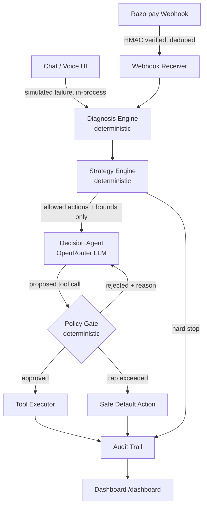

# Project Lazarus

**AI-powered revenue recovery agent** — built for the Razorpay Buildathon, Track 03.

Detects revenue at risk (failed payments, abandoned checkouts, overdue B2B invoices),
diagnoses the cause deterministically, negotiates the recovery *within merchant-defined
bounds* using an LLM, and sends a fresh payment link — with every decision logged and
every LLM action re-validated against a strategy config it cannot override.

> The LLM is a **negotiator inside a fence**, not a decision-maker. The fence — discount
> caps, retry limits, cooldowns — is deterministic code the merchant configures. Every
> proposed tool call is checked against it before anything executes.

## Try it live

**https://project-lazarus-iota.vercel.app**

| Route | What it shows |
|---|---|
| [`/chat`](https://project-lazarus-iota.vercel.app/chat) | Pick a scenario (subscription failure, checkout abandonment, B2B receivable, or a hard-stop case), simulate the failure, and talk to Lazarus turn by turn. Ask for a bigger discount than the rule allows — the policy gate's rejection shows up live in the chat. |
| [`/voice`](https://project-lazarus-iota.vercel.app/voice) | Same gated architecture, shaped as a phone call — a pre-dial consent/cooldown/quiet-hours gate runs before anything is "spoken", and every utterance is checked before it's sent. |
| [`/dashboard`](https://project-lazarus-iota.vercel.app/dashboard) | Audits everything: the completed 50-case batch run, every live chat/voice case, a real-time activity feed, and a live-editable strategy config — edits apply to the next case immediately. |

## Status

The full 50-case batch has run end-to-end against the real agent: **38 actioned (76%), 2
correctly hard-stopped, 10 no-action, 0 errors**. See
[`data/metrics_report.md`](data/metrics_report.md) for the full breakdown and
[`docs/pitch_script.md`](docs/pitch_script.md) for two real, unstaged guardrail-rejection
events pulled from that run.

## Architecture



The LLM decides **which** allowed action to take and **how** to phrase it. It never decides
**how much** (discount %) or **how many times** (retries) — that comes from the strategy
config, and every proposed tool call is re-checked against it in code, including the message
text itself, before anything executes. A customer's reply can change what the agent *says*,
never what it's *allowed to do*.

## What's live vs. simulated

Honest accounting — nothing here is aspirational.

| Component | Status |
|---|---|
| Razorpay webhook: signature verification + idempotency | Live — SQLite-backed dedupe, survives a restart |
| Razorpay test-mode orders | Live — `scripts/create_razorpay_orders.py` |
| Diagnosis engine (error code → cause) | Live — deterministic, unmapped codes fall to `unknown` |
| Strategy engine (discount caps, cooldowns, hard stops) | Live — includes a B2B receivables rule |
| Decision agent | Live — OpenRouter (`z-ai/glm-5.3-flash`), capped reject-and-correct loop. Swap in a free `:free` model via `OPENROUTER_MODEL` if you don't want to add a paid key |
| Policy gate | Live — action/discount/retry/cooldown checks + message-body scan |
| Customer history (LTV, abandon count, cooldown) | Live, SQLite — LTV/opt-in are placeholders pending a real CRM |
| 50-case batch (`data/batch_cases.json`) | Checkout-abandonment is fully real (real unpaid test-mode orders). Subscription-failure uses real orders with a modeled failure event (Razorpay test mode can't force a card decline outside the browser flow). Receivables are synthetic by design |
| Chat UI (`/chat`) | Live — multi-turn, same agent loop and gate as the webhook pipeline; failure trigger is simulated in-process |
| Voice channel (`/voice`) | verified live (text-simulated turns, and real Sarvam STT/TTS over WebRTC). Details: [`docs/voice.md`](docs/voice.md) |
| Dashboard (`/dashboard`) | Live — batch metrics, live case list, per-case audit trail, activity feed, editable strategy config |
| Hosting | Live on Vercel; storage auto-switches to Turso (libSQL) via `DATABASE_URL` since Vercel's filesystem is ephemeral |

## Quick start (local)

```bash
python -m venv .venv && .venv/Scripts/activate
pip install -e ".[dev]"
cp .env.example .env   # then fill in your keys
uvicorn app.main:app --reload
```

Open `http://localhost:8000/chat`, `/voice`, and `/dashboard`. `DATABASE_URL` is optional —
leave it blank and every store (webhook dedupe, customer history, audit trail, conversations,
strategy config) runs on local SQLite/JSONL under `data/`, so the project runs from a clean
clone with no external services.

## Repo layout

```
app/          FastAPI app: diagnosis, strategy, agent, policy gate, stores, routes
app/voice/    Voice channel (gate, dialogue, verify, session, telephony)
config/       Merchant strategy config + voice dialogue config
data/         Batch cases, results, metrics report
scripts/      Batch runner, report generator, Razorpay order creation
static/       /chat, /voice, /dashboard front ends
tests/        90 tests — diagnosis, strategy, gate, agent loop, voice, webhook
docs/         Architecture pitch, pitch script, voice channel writeup
```

## Docs

- [`docs/pitch_script.md`](docs/pitch_script.md) — 5-minute pitch outline with real numbers
- [`docs/voice.md`](docs/voice.md) — voice channel, phase by phase, what's verified vs. not
- [`data/metrics_report.md`](data/metrics_report.md) — full batch breakdown + exception list
- [`docs/plan.md`](docs/plan.md) — original design doc from project kickoff (historical)
