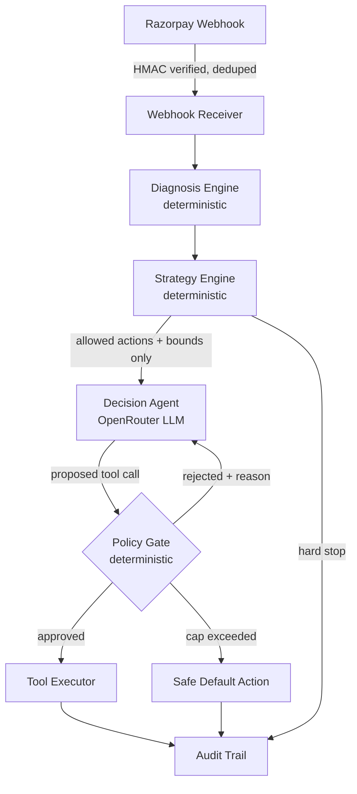

# Project Lazarus

**AI-powered revenue recovery agent** — Razorpay Buildathon, Track 03.

Detects revenue at risk (payment drop-offs, checkout abandonment, failed subscriptions),
diagnoses the cause deterministically, negotiates the recovery *within merchant-defined
bounds* using an LLM, and resumes the customer's exact checkout state via a deep link —
with every decision logged and every LLM action re-validated against a strategy config
it cannot override.

> The LLM is a **negotiator inside a fence**, not a decision-maker. The fence — discount
> caps, retry limits, cooldowns — is deterministic code the merchant configures. Every
> proposed tool call is checked against it before anything executes.

## Status

The full 50-case batch has completed end-to-end: **41 actioned (82%), 2 correctly
hard-stopped, 7 no-action**, live against the real agent — see
[`data/metrics_report.md`](data/metrics_report.md) for the full breakdown and honest
exception list. See [`docs/plan.md`](docs/plan.md) for the architecture and timeline, and
[`docs/pitch_script.md`](docs/pitch_script.md) for the 5-minute pitch outline.

## Architecture



The LLM decides **which** allowed action to take and **how** to phrase it. It never decides
**how much** (discount %) or **how many times** (retries) — those come from the strategy
config, and every proposed tool call is re-checked against them in code before anything
executes.

## What is live vs. simulated

This table is the honest accounting. It is updated as components land — nothing here is
aspirational.

| Component | Status |
|---|---|
| Razorpay webhook receipt + signature verification + idempotency | Done — SQLite-backed dedupe, survives restart |
| Razorpay test-mode orders | Done — `scripts/create_razorpay_orders.py`, real orders via the live test API |
| State serialization / checkout hydration | Not started |
| Error diagnosis engine | Done — deterministic, unmapped codes fall to `unknown`, no code at all means `abandoned_checkout` |
| Strategy config engine | Done — hard_stops → rules → defaults, includes a B2B receivables rule |
| Decision agent (OpenRouter) | Done — capped reject-and-correct loop, live-run against a free tool-calling model (`nvidia/nemotron-3-super-120b-a12b:free`) across the full 50-case batch. **Free-tier only, by explicit project policy** — no paid model or API usage. OpenRouter's free tier shares one account-wide cap (50 requests/day across *all* free models combined, not per-model), so the run spanned two daily quota windows; `scripts/run_batch.py` resumed automatically and re-spent no calls on cases that had already succeeded. |
| Policy gate | Done — action/discount/retry/cooldown + message-body scan |
| Webhook → agent pipeline wiring | Done — `payment.failed` only; checkout abandonment needs separate tracking (not built) |
| Customer history store (LTV, abandon count, cooldown) | Done, SQLite — LTV/opt-in are placeholders pending real CRM backfill |
| 50-record batch (`data/batch_cases.json`) | 20 subscription-failure / 15 checkout-abandonment / 15 receivable. **checkout-abandonment** is now fully real (`is_synthetic: false`) — real test-mode orders, genuinely left unpaid, exactly as plan §8 specifies. **subscription-failure** stays `is_synthetic: true` — the order is real but the failure event is still modeled (Razorpay's test mode has no server-only way to force a card decline outside the checkout.js/browser flow; plan §8 itself specifies "orders + modeled failure events"). **receivable** stays fully synthetic by design. |
| Batch runner (`scripts/run_batch.py`) | Done — full live run completed, 50/50 cases resolved. `--dry-run` resolves diagnosis+strategy only (no API key, no cost) |
| Metrics report (`scripts/generate_report.py` → `data/metrics_report.md`) | Done — recovery-attempt rate, outcome breakdown by category, guardrail evidence, honest exception list |
| WhatsApp delivery | Not started — `console` channel is the default |

## Quick start

```bash
python -m venv .venv && .venv/Scripts/activate
pip install -e ".[dev]"
cp .env.example .env   # then fill in your keys
uvicorn app.main:app --reload
```

Redis is optional. The default state store is SQLite so the project runs from a clean
clone with no external services.

## Repo conventions

- One PR per feature, squash-merged into `main`. `main` stays green.
- Conventional commits (`feat:`, `fix:`, `test:`, `docs:`, `chore:`).
- Secrets live in `.env` (gitignored). `.env.example` documents the shape.
- CI runs `ruff` + `pytest` on every PR.

## License

MIT
