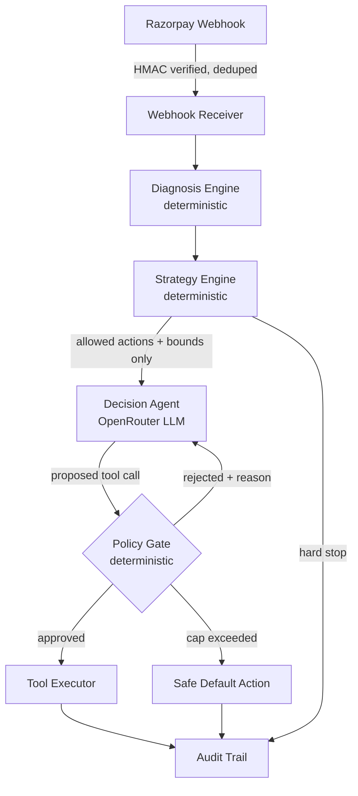

# Pitch Script — Project Lazarus (5 minutes)

Structure per `plan.md` §9: headline number first, one guardrail-rejection shown live, then
architecture. Numbers below are filled in from the completed run of
`data/metrics_report.md` (50/50 cases resolved) — re-run `scripts/generate_report.py` and
update this file if the batch is ever re-run and the numbers shift.

---

## 0:00–0:45 — The headline number

> "We built an agent that recovers revenue Razorpay merchants are currently losing to
> failed payments, abandoned checkouts, and overdue B2B invoices. Here's the number that
> matters: out of a 50-case batch spanning all three failure types, the agent proposed and
> the system approved a recovery action in **82% of cases (41/50)** — entirely autonomously,
> with zero human review of any individual case. Another 4% — 2 cases — were correctly
> blocked from any outreach at all, before the agent was even called."

Show `data/metrics_report.md`'s headline section on screen. Say the recovery-**attempt** rate
out loud explicitly as attempt rate, not "recovered ₹__" — there's no live customer in this
batch, so a rupee figure would be fiction. Judges who've built payment systems will notice
if you don't self-correct this; self-correcting it here is a credibility signal, not a weakness.

## 0:45–2:15 — The guardrail, shown live (the actual differentiator)

> "Every other 'AI recovery agent' submission you'll see today lets the model decide the
> discount. We don't. Watch what happens when it tries."

Two things actually happened in the completed 50-case run worth showing, in this order:

1. **The reject-and-correct loop, demonstrated live on screen** — the free model we used never
   tried to exceed its bounds in this particular run (a real, honest result — say so, don't
   dress it up), so demo the mechanism directly instead of hoping for one to appear:
   run `pytest tests/test_agent_gate_loop.py::test_repeated_out_of_bounds_calls_hit_gate_exhausted -v`
   on screen and narrate as it runs — the test scripts the agent proposing a 50% discount on
   a case capped at 0%, four times in a row, and the gate rejects every single one before
   falling back to a safe default message, logged as `gate_exhausted`, never a silent
   failure. This is the actual code path that would fire on a real out-of-bounds attempt —
   showing it directly is more honest than implying it happened live when it didn't.
2. **A real hard-stop from the batch**, e.g. `batch_sub_017` or `batch_checkout_005` in
   `data/batch_results.json` (`outcome: "hard_stop"`) — a repeat abandoner and an opted-out
   customer, where the strategy engine blocked outreach *before the LLM was ever called*.
   Say explicitly: "the agent never even got a chance to overreach here — the fence closed
   before it opened."

> "The LLM never sees a raw discount authority — only the bounds a merchant already approved.
> And even inside those bounds, every single proposed action is re-checked in code, not in
> the prompt. A prompt injection from a customer message literally cannot widen what this
> agent is allowed to do."

## 2:15–4:00 — Architecture, in one breath per box

Walk `docs/plan.md`'s architecture diagram (or the Mermaid version — see below) top to bottom:

1. Razorpay webhook → signature verified, deduped (survives a restart — SQLite-backed, not
   in-memory)
2. Deterministic diagnosis + strategy engine — no LLM, no cost, no hallucination risk, on
   the part of the system that decides *what's allowed*
3. The agent — OpenRouter, model-agnostic by design, decides *which* allowed action and *how*
   to phrase it
4. The policy gate — re-validates every proposal: action allowed, discount within cap, retry
   count within limit, cooldown respected, **and the message text itself scanned** so the
   agent can't just *say* a number it didn't get approved
5. Audit trail — every diagnosis, strategy decision, LLM turn, and gate verdict logged to
   JSONL, end to end

> "Here's the line worth remembering: the LLM decides *which* tool and *how to say it* —
> never *how much* or *how many times*. That's the fence."

## 4:00–4:45 — What's real vs. modeled (the honesty slide)

Show the README's status table directly, don't paraphrase it into something rosier.

> "We're not going to pretend everything here is production. Checkout-abandonment orders are
> real Razorpay test-mode orders, genuinely left unpaid. Subscription-failure orders are real
> too, but the failure event is modeled — Razorpay's test mode has no server-only way to force
> a card decline outside a real checkout flow. B2B receivables are fully synthetic by design.
> We'd rather tell you that now than have you find it in the code."

## 4:45–5:00 — Close

> "The bet we made: the interesting engineering problem in an AI agent handling money isn't
> making the model smarter — it's making sure it can't do anything you didn't explicitly
> allow, and proving that on every single call. That's Project Lazarus."

---

## Mermaid architecture diagram (for slides or the README)

## Recording checklist

- [ ] Have `pytest tests/test_agent_gate_loop.py -v` ready to run live (this is the guardrail demo)
- [ ] Have `batch_sub_017` or `batch_checkout_005` looked up in `data/batch_results.json` beforehand
- [ ] Have `data/metrics_report.md` and `README.md`'s status table open in separate tabs
- [ ] Time yourself once, unscripted, before the real take — 5 minutes goes fast
